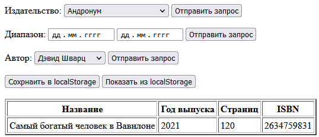
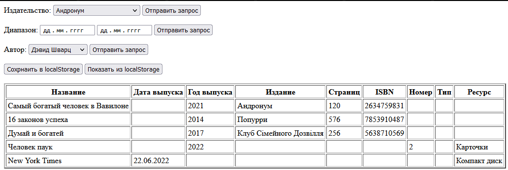
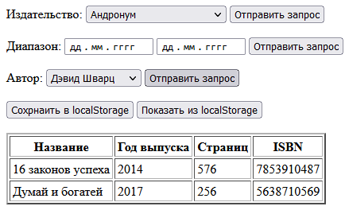
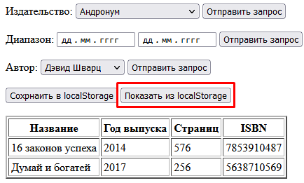

# Лабораторная работа №2
Медведчук Константин КИУКИу-20-2, Вариант 0

### Техническое задание
Создать и заполнить БД для хранения информации о литературных ресурсах библиотеки (книгах, газетах, журналах и т.д.). Для описания множества литературных ресурсов достаточно использовать одну коллекцию. Каждый ресурс, представленный в виде документа в составе коллекции, характеризуется набором свойств (и каждый, возможно, своим собственным, особым набором). Например, книги могут характеризоваться названием, уникальным номером (ISBN), издательством, годом издания, количеством страниц, автором (авторов может быть больше одного). У каких-то книг какого-то из перечисленных для примера свойств может и не быть, или быть какое-то новое свойство (например, наличие в комплекте диска). Журналы характеризуются обычно названием, годом выпуска, номером. Помните, что нет жесткого ограничения на одинаковый набор полей для разных ресурсов, пользуйтесь преимуществами MongoDB. Запросы на выборку предполагают, что требуемые поля будут у какой-то части документов в коллекции - но совсем не обязательно, что у всех.

Предоставить пользователю возможность получения информации о:

- литературе указанного издательства; 
- литературе, опубликованной за указанный временной период (учитывать год издания); 
- литературе указанного автора.

## Скриншоты

> Информация о литературе указанного издательства

---

> Информация о литературе, опубликованной за указанный временной период (учитывать год издания)

---

> Информация о литературе указанного автора

---
## Работа с localStorage

